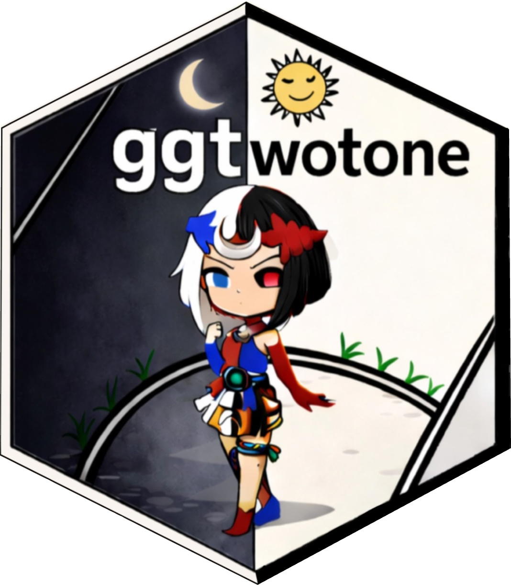

# ggtwotone [](https://bwanniarachchige2.github.io/ggtwotone/)

`ggtwotone` extends `ggplot2` with dual-stroke and contrast-aware geoms
that improve the visibility of annotations, curves, and labels on
heterogeneous backgrounds. The package is designed for figures
containing images, maps, heatmaps, microscopy data, or other complex
visualizations where standard single-color annotations may become
difficult to distinguish.

## Documentation

Complete documentation, reference manuals, and additional examples are
available at [Reference](https://bwanniarachchige2.github.io/ggtwotone/)
Manual, or see them in the R help tab after loading the package.

## Key Features

- Dual-stroke segments
- Dual-stroke curves and paths
- Dual-stroke regression lines
- Contrast-aware text labels
- Automatic highlight palettes
- WCAG/APCA-based color utilities

## Why ggtwotone?

Standard annotations often become difficult to distinguish on complex or
heterogeneous backgrounds, such as microscopy images, maps, photographs,
or heatmaps. ggtwotone addresses this problem by combining dual-stroke
rendering with contrast-aware color selection.

- Improved visibility
- Better accessibility
- Grayscale-friendly figures
- Publication-ready graphics

## Installation

### Development version

``` r

# install.packages("pak")
pak::pak("bwanniarachchige2/ggtwotone")
```

*(After CRAN release this section will simply become
`install.packages("ggtwotone")`.)*

## Quick Example

The example below demonstrates how
[`geom_segment_dual()`](reference/geom_segment_dual.md) and
[`geom_text_contrast()`](reference/geom_text_contrast.md) improve
measurement overlays on a microscopy image.

``` r

library(ggtwotone)
library(magick)

img_path   <- "man/figures/micro_image.jpg"
um_per_px  <- 0.05                  # <-- calibration: micrometers per pixel
bar_um     <- 10                    # scale bar length in micrometers

# Load image as a background grob
img <- magick::image_read(img_path)
w   <- magick::image_info(img)$width
h   <- magick::image_info(img)$height
bg  <- grid::rasterGrob(img, width = unit(1, "npc"), height = unit(1, "npc"))


meas <- data.frame(
  x = 0.3218, y = 0.4507, xend = 0.7974, yend = 0.6371   # <-- adjust to your line
)

# Compute physical length for the label
dx_px  <- abs(meas$xend - meas$x) * w
dy_px  <- abs(meas$yend - meas$y) * h
len_um <- sqrt(dx_px^2 + dy_px^2) * um_per_px
lab    <- sprintf("%.1f \u00B5m", len_um)

# Midpoint for the label
xm <- (meas$x + meas$xend)/2
ym <- (meas$y + meas$yend)/2
lab_df <- data.frame(x = xm, y = ym + 0.05, label = lab)

#Plot
ggplot() +
  # background SEM image
  annotation_custom(bg, xmin = 0, xmax = 1, ymin = 0, ymax = 1) +
  # measurement line with dual stroke
  geom_segment_dual(
    data = meas,
    aes(x = x, y = y, xend = xend, yend = yend),
    colour1 = "#0D0D0D",
    colour2 = "#FFFFFF",
    linewidth = 1.2,
    lineend = "round",
    arrow = grid::arrow(ends = "both", length = unit(0.18, "in"), type = "open") 
  ) +
  # measurement label (contrast-aware)
  geom_text_contrast(
    data = lab_df,
    aes(x = x, y = y, label = label),
     background = "#444444",
    size = 4.2
  ) +
  coord_fixed(xlim = c(0, 1), ylim = c(0, 1), expand = FALSE) +
  theme_void()
```


Dual-stroke annotations remain clearly visible regardless of the local
background, while labels automatically adapt to maintain contrast.

> **Image credit**
>
> SEM micrograph adapted from **Marie Majaura**, *Own work*, licensed
> under **CC BY-SA 3.0**. Used under the terms of the license.

# Additional Example

The following example illustrates automatic contrast-aware labeling on a
thematic map.

``` r

# Packages
library(ggplot2)
library(dplyr)
library(sf)
library(scales)
library(rnaturalearth)
library(rnaturalearthdata)

# Africa polygons
africa <- rnaturalearth::ne_countries(
  continent = "Africa", scale = "medium", returnclass = "sf"
)

# Simple variable (simulate GDP per capita, k USD)
set.seed(1)
africa$gdp_pc <- runif(nrow(africa), min = 1, max = 30)

# Palette + per-country HEX for contrast
pal <- c("#0C2C84", "#41B6C4", "#A1DAB4", "#FFFFCC", "#FDAE61", "#D73027")
col_fun <- scales::col_numeric(palette = pal,
                               domain = range(africa$gdp_pc, na.rm = TRUE))
africa$fill_hex <- col_fun(africa$gdp_pc)

# Label positions
labels <- africa %>%
  mutate(
    point = sf::st_point_on_surface(geometry),
    lon   = sf::st_coordinates(point)[, 1],
    lat   = sf::st_coordinates(point)[, 2],
    area  = as.numeric(sf::st_area(geometry)),
    code  = iso_a3
  ) %>%
  dplyr::slice_max(area, n = 20)

# Plot
ggplot(africa) +
  geom_sf(aes(fill = gdp_pc), color = "white", linewidth = 0.2) +
  geom_text_contrast(
    data = labels,
    aes(x = lon, y = lat, label = code),
    inherit.aes = FALSE,
    background  = labels$fill_hex,
    base_colour = "blue",
    method = "auto", contrast = 4.5,
    size = 2.5, fontface = "bold"
  ) +
  scale_fill_gradientn(colours = pal, name = "GDP per Capita (k USD)") +
  coord_sf(expand = FALSE) +
  labs(title = "Simulated Africa Map with Auto-Contrast Labels", x = NULL, y = NULL) +
  theme_minimal(base_size = 11) +
  theme(panel.grid = element_blank(), axis.text = element_blank())
```


Country labels automatically adjust their foreground color according to
the underlying fill color, improving readability across the map.

## Citation

If you use **ggtwotone** in published work, please cite

``` r

citation("ggtwotone")
```

(after the package is available on CRAN).

## License

MIT License.
